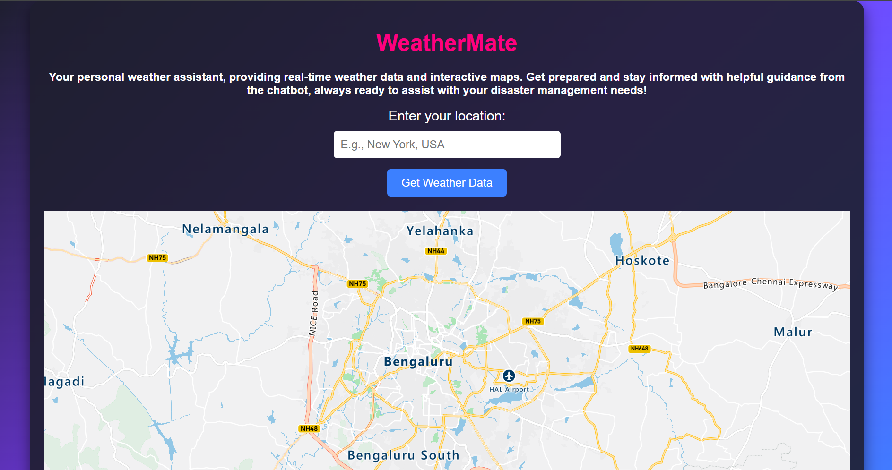

# WeatherMate: A Weather Dashboard with Interactive Map and Chatbot Integration

**WeatherMate** is an advanced weather dashboard that provides real-time weather data, an interactive map powered by Azure Maps, and an AI-driven chatbot. Built to deliver a seamless user experience, this application allows users to check weather details, explore locations on the map, and ask personalized weather queries.

## Key Features

- **Live Weather Data**: Fetch real-time weather information based on user-selected locations or current geolocation.
- **Interactive Map**: Explore weather data visually with Azure Maps integration, offering dynamic map interaction and location search.
- **Chatbot Integration**: Engage with a chatbot that answers weather-related queries and provides intelligent responses.

## Technologies Used

- **Azure Maps**: Provides map integration and geolocation services for displaying weather data.
- **GitHub Copilot**: Utilized for code generation, improving productivity and assisting in solving complex coding challenges.
- **Node.js**: Backend server handling requests, fetching weather data, and enabling chatbot functionality.
- **VS Code Extensions**: Utilized extensions for enhanced development such as code completion, linting, and version control integration.

## Screenshots

### Weather Dashboard Interface and Interactive Map
This is the main weather dashboard, displaying an interactive map where users can explore weather conditions across different regions.

### Weather Data
Displays current weather conditions based on user-selected locations.

### Chatbot Interaction
Chatbot interface where users can ask specific weather-related queries.

## Installation

To get started with WeatherMate, follow the steps below:

1. Clone the repository:

